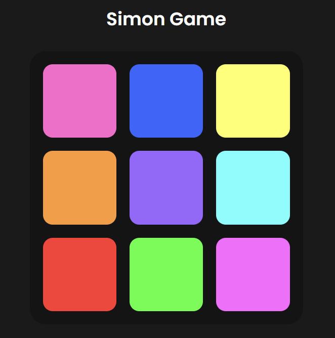

# Simon_Game.html

Simon Game est une implémentation web du jeu de mémoire classique Simon, où les joueurs doivent se souvenir et répéter une séquence de couleurs. Ce projet est réalisé en HTML, CSS et JavaScript.

<!--  -->

## Auteur

- [Romain Boiret](https://github.com/RomainBoiret)
- Date de création : 18 Avril 2024

## Fonctionnalités

- Générer des séquences aléatoires de couleurs pour que les joueurs les mémorisent.
- Afficher la séquence au joueur avec des indices visuels.
- Permettre aux joueurs de cliquer sur les couleurs pour répéter la séquence.
- Suivre le score et le niveau du joueur.
- Fournir un bouton de démarrage pour lancer le jeu.
- Offrir un bouton de réinitialisation pour redémarrer le jeu à tout moment.

## Démo

Vous pouvez jouer au jeu en direct [ici](https://romainboiret.github.io/Simon_Game.html/).

## Installation

Pour exécuter ce jeu localement, suivez ces étapes :

1. Clonez ce dépôt : `git clone https://github.com/RomainBoiret/Simon_Game.html.git`.
2. Accédez au répertoire du projet : `cd Simon_Game.html`.
3. Ouvrez le fichier `index.html` dans votre navigateur Web préféré.

## Utilisation

- Cliquez sur le bouton "Start" pour commencer le jeu.
- Mémorisez la séquence de couleurs affichée.
- Cliquez sur les couleurs dans le même ordre pour répéter la séquence.
- Chaque répétition réussie augmente votre score et vous fait passer au niveau suivant.
- Cliquez sur le bouton "Reset" pour redémarrer le jeu à tout moment.

## Contribution

Les contributions sont les bienvenues ! Si vous souhaitez contribuer à ce projet, suivez ces étapes :

1. Forker le dépôt.
2. Créez une nouvelle branche (`git checkout -b feature/amélioration`).
3. Effectuez vos modifications.
4. Faites un commit de vos modifications (`git commit -am 'Ajouter une nouvelle fonctionnalité'`).
5. Poussez la branche (`git push origin feature/amélioration`).
6. Créez une nouvelle demande de fusion (Pull Request).

## Licence

Ce projet est sous licence MIT - voir le fichier [LICENSE](./LICENSE) pour plus de détails.
